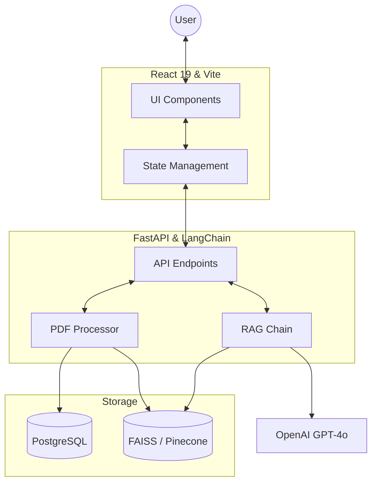

# 🧠 DocMind — AI-Powered Document Intelligence

[](https://fastapi.tiangolo.com/)
[](https://reactjs.org/)
[](https://tailwindcss.com/)
[](https://www.docker.com/)

DocMind is a sophisticated, production-ready Retrieval-Augmented Generation (RAG) platform. It empowers users to upload complex PDF documents and engage in context-aware conversations using semantic search and state-of-the-art LLMs.

---

## 🏗️ Architecture



---

## ✨ Features

-   **📁 Seamless Document Ingestion**: Robust PDF processing with intelligent text extraction and chunking.
-   **🔍 Semantic Search**: Advanced vector search using OpenAI embeddings and FAISS (local) or Pinecone (cloud).
-   **💬 Contextual Conversations**: Streamed chat responses powered by GPT-4o, providing a fluid user experience.
-   **📍 Precision Citations**: Every response includes direct citations to the source document, including page numbers.
-   **💎 Premium UI**: A modern, responsive interface built with React 19 and Tailwind CSS, featuring smooth animations and dark mode support.
-   **🚀 Ready for Production**: Fully containerized with Docker, supporting both PostgreSQL and SQLite.

---

## 🛠️ Tech Stack

### Backend
-   **Framework**: [FastAPI](https://fastapi.tiangolo.com/)
-   **Orchestration**: [LangChain](https://www.langchain.com/)
-   **Database**: PostgreSQL (Production) / SQLite (Development)
-   **Vector Store**: FAISS (Local) / Pinecone (Cloud)
-   **LLM**: OpenAI GPT-4o
-   **Embeddings**: OpenAI `text-embedding-3-small`

### Frontend
-   **Framework**: [React 19](https://react.dev/)
-   **Build Tool**: [Vite](https://vitejs.dev/)
-   **Styling**: [Tailwind CSS](https://tailwindcss.com/)
-   **Icons**: [Lucide React](https://lucide.dev/)
-   **Communication**: Axios with streamed response support

---

## 🏗️ Project Structure

```text
.
├── docmind/
│   ├── backend/          # FastAPI server and RAG logic
│   │   ├── app/          # Main application code
│   │   │   ├── api/      # API endpoints
│   │   │   ├── core/     # Configuration and logging
│   │   │   ├── models/   # DB models
│   │   │   └── services/ # PDF processing and RAG chain
│   │   └── tests/        # Backend test suite
│   ├── frontend/         # React SPA
│   │   ├── src/          # Source code
│   │   │   ├── components/
│   │   │   ├── hooks/
│   │   │   └── services/
│   └── docker-compose.yml
└── README.md
```

---

## 🚦 Getting Started

### Prerequisites
-   Docker and Docker Compose
-   OpenAI API Key

### Quick Start with Docker (Recommended)

1.  **Clone the repository**:
    ```bash
    git clone https://github.com/yourusername/docmind.git
    cd docmind
    ```

2.  **Configure environment variables**:
    Create a `.env` file in `docmind/backend/`:
    ```bash
    cp docmind/backend/.env.example docmind/backend/.env
    # Edit docmind/backend/.env and add your OPENAI_API_KEY
    ```

3.  **Launch the stack**:
    ```bash
    cd docmind
    docker-compose up --build
    ```

4.  **Access the application**:
    -   **Frontend**: [http://localhost:5173](http://localhost:5173)
    -   **API Documentation**: [http://localhost:8000/docs](http://localhost:8000/docs)

---

## 🧪 Development & Testing

### Manual Backend Setup
```bash
cd docmind/backend
python -m venv venv
source venv/bin/activate  # venv\Scripts\activate on Windows
pip install -r requirements.txt
pytest  # Run tests
uvicorn main:app --reload
```

### Manual Frontend Setup
```bash
cd docmind/frontend
npm install
npm run dev
```

---

## 🛡️ License

This project is licensed under the MIT License - see the [LICENSE](LICENSE) file for details.

---

<p align="center">
  Built with ❤️ by the DocMind Team
</p>
